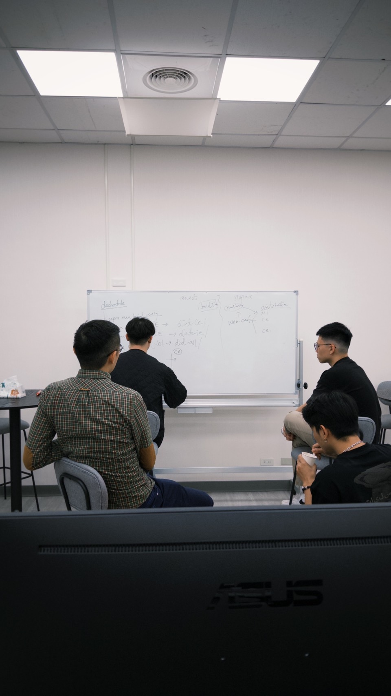

# Alfredo Tang's Vue Practice and POC project

## Table of Contents

- [Alfredo Tang's Vue Practice and POC project](#alfredo-tangs-vue-practice-and-poc-project)
  - [Table of Contents](#table-of-contents)
  - [folder structure as router (vue)](#folder-structure-as-router-vue)
  - [folder structure as router (react)](#folder-structure-as-router-react)
  - [react and vue bridge](#react-and-vue-bridge)
  - [Alison ui](#alison-ui)

## folder structure as router (vue)

see [vue.md](./docs/vue.md)

## folder structure as router (react)
see [react.md](./docs/react.md)

## react and vue bridge
see [bridge.md](./docs/bridge.md)

## Alison ui
see [alison-ui.md](./docs/alison-ui.md)